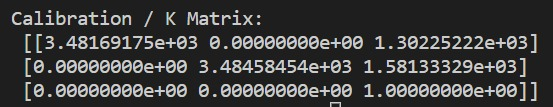
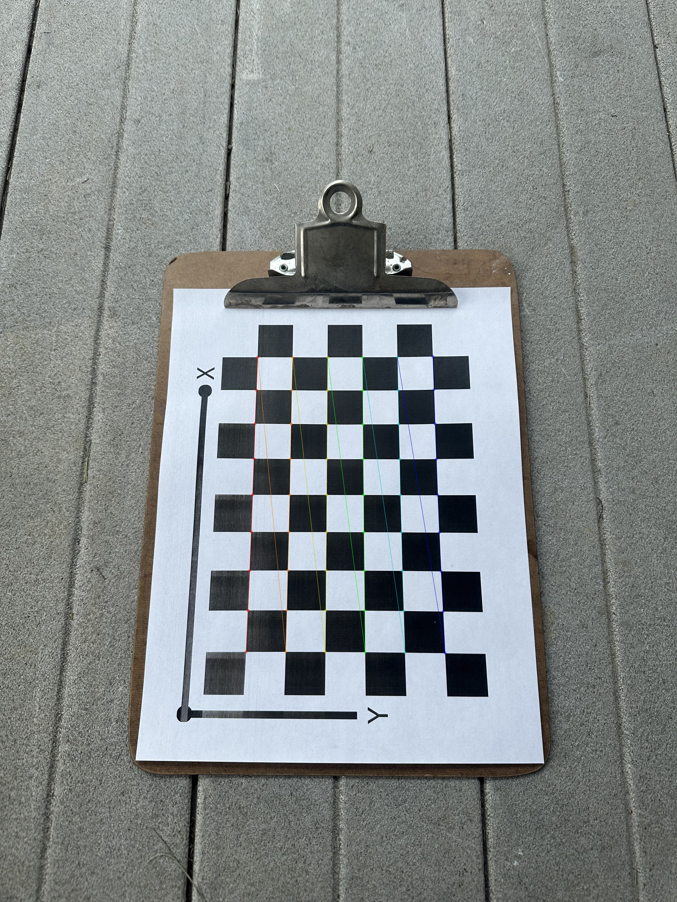
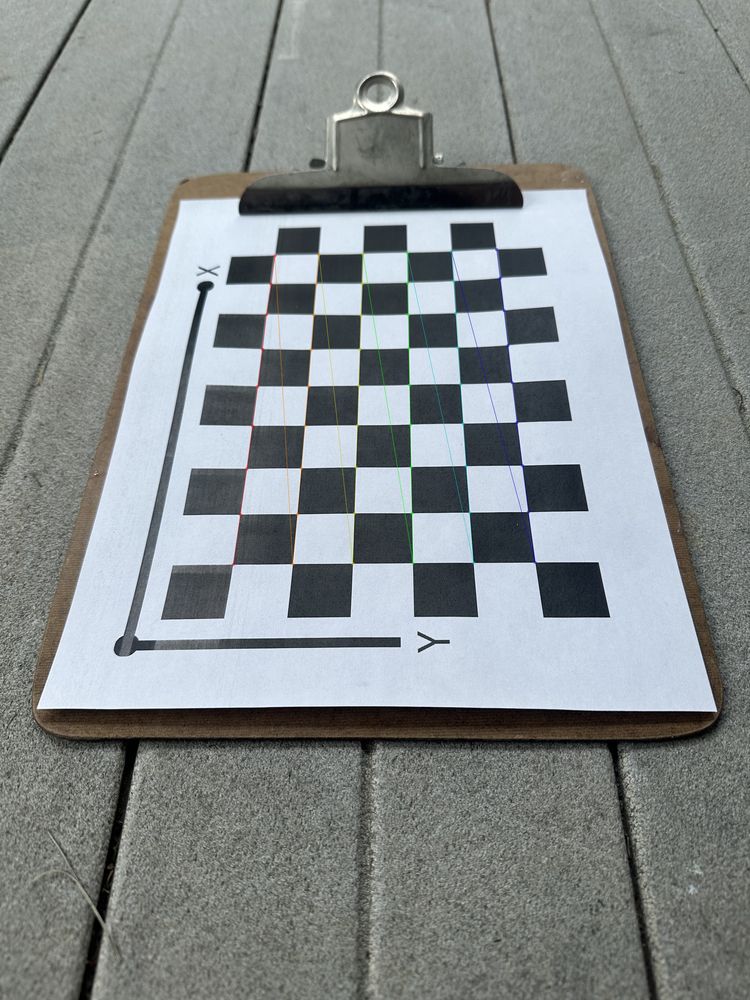
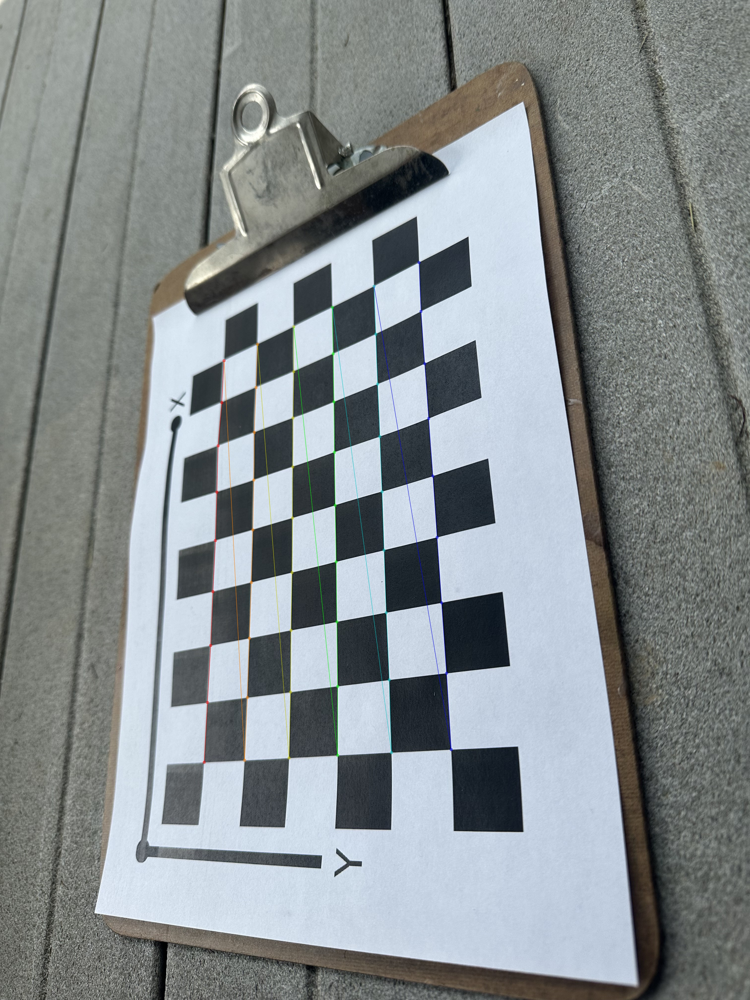
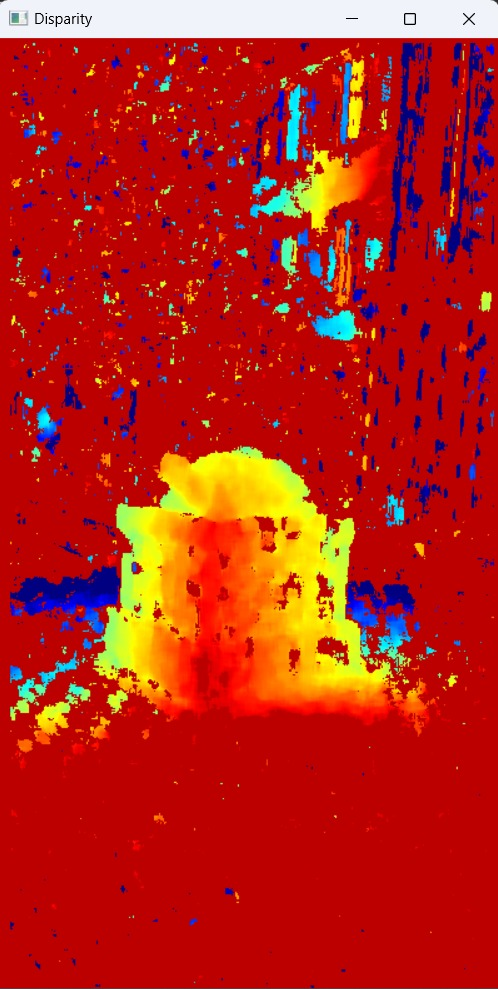
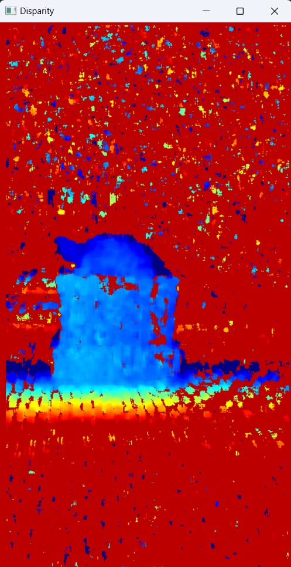

# ENPM673 Perception for Autonomous Robots | Final Project

GitHub  :   https://github.com/sshah115/multiview-3d-reconstruction

## Team

|Name|UID|Directory ID|
|:---:|:---:|:---:|
|Shail Kiritkumar Shah|119340547|sshah115@umd.edu|
|Paul Monaghan|113505904|pmonagha@umd.edu|
|Abdul Noor Mohammed|118530185|amohamm6@umd.edu|
|Rohit Reddy Pakhala|119399125|rpakhala@umd.edu|
|Alexander Tyler Warder|||


# Multiview 3d reconstruction

Constructing 3d point clouds from multi-view images and visualizing it.

## Python Files

It is stored in the directory multiview-3d-reconstruction.zip / scripts

## Running the code
There are four ways of running a python script which are as follows:

 - You may run it in your operating system's terminal. For e.g., In windows - cmd.
 - Python interactive mode.
 - Integrated Development Environment (IDE) like VSC.
 - Opening the script file from folder

First check the version of python installed in your system by running following command:

*python --version*

If it yields result like this one:

*Python 3.8.10*

Then you may run script in terminal by typing following line in the directory it is located at:

*python3 question1.py*

## Dependencies

import following libraries for the script to run correctly: 

*import  numpy as np* 

*import cv2 as cv*

*import os*

## Result

After running the code through IDE or terminal the following will be shown as result:

1. Calibration matrix or K matrix



### Sample - 1



### Sample - 2



### Sample - 3



2. Depth map

Depth map has been computed for complete video, however, two instances have been shown below as example:

### Sample - 1



### Sample - 2



```
The important thing to note is the address to fetch the images. The images can be kept in the same folder as its script and the terminal path can be changed to the directory where the script and ./Calibration_Imgs is then path can be just its name as under:

dirPath = './../captures'

However if the terminal path of IDE is in different directory then absolute path needs to be provided as under:

dirPath = "D:/02_Semester-2/02_ENPM673_Perception/02_Assignments/Final_project/captures"

```